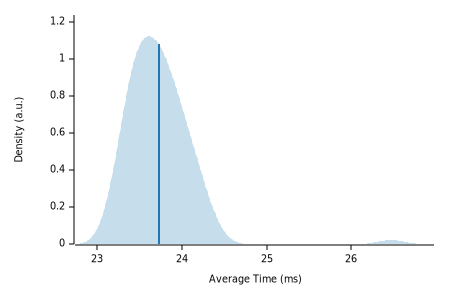

# QR-RS

A simple server and CLI that generates QR Codes and overlays a logo on top of them.

  

## Documentation

Documentation has been moved [here](https://antoniosbarotsis.github.io/qr-rs/).

## The Sub-Folders

This repo currently contains 4 crates:

- [`lib`](./lib): The core logic of the QR Code generation
- [`server`](./server): A server you can run locally to use the `lib` crate
- [`cli`](./cli): A command line interface to the `lib` crate
- [`common`](./common): Some reusable code for `server` and `cli`

The server and CLI use the library in a specific manner according to 
[GDSC Delft](https://gdsc.community.dev/delft-university-of-technology/)'s needs and are therefore
not really reusable unlike the library itself. Feel free to use it as an example if you want to
create something similar though! 

## Roadmap

A `v1.0` roadmap can be found [here](https://github.com/users/AntoniosBarotsis/projects/3/views/1).

## Testing

> **Note** This section talks about testing the *readability* of the generated QR Codes.
  Conventional unit tests are in place.

I made a few attempts at testing but none of them really resulted in what I wanted so I ended up
removing them.

I first tried using [proptest](https://github.com/proptest-rs/proptest) which was great but I
couldn't find a way to generate URLs that contained only ASCII characters which is what I'm
interested in for the time being. I could generate valid URIs after searching for regular
expressions and filter the ones that contained valid ASCII characters only but that would largely
mean that I would not be able to tell how many of the tests that `proptest` ran were indeed 
*running*.

I then tried to find a URL dataset on sites like Kaggle, and that's when I found out that the
QR Code reader crate I was using could not always read the QR Codes even though my phone could
which invalidated the tests.

I might come back to this in the future but for the time being, manual testing seems "good enough".

## Benchmarks

After some googling, I found [this](http://www.supermind.org/blog/740/average-length-of-a-url-part-2)
blog post which explains how, for the 6 million URLs that they used, concluded that about 95% were
at most 150 characters long.

I created a benchmark using [`criterion.rs`](https://github.com/bheisler/criterion.rs) where I
create 100 strings of 150 characters and test how quick the QR Code generation is. It takes around
30ms (at the time of writing this) on my machine which is pretty good for my use case.

  

