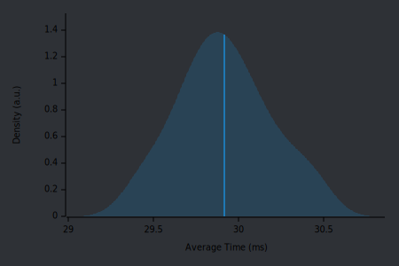

# QR-RS

[](https://github.com/AntoniosBarotsis/qr-rs/actions/workflows/ci-server.yml)
[](https://deps.rs/repo/github/AntoniosBarotsis/qr-rs?path=.)
<!-- [](https://hub.docker.com/r/antoniosbarotsis/qr-rs) -->

A simple server that generates QR Codes and overlays a logo on top of them.

<p align="center">
  
</p>

## The Server & the Library

This repo contains 2 crates: the server and a reusable library at [`lib`](./lib/).

The server uses the library in a specific manner according to 
[GDSC Delft](https://gdsc.community.dev/delft-university-of-technology/)'s needs and is therefore
not really reusable unlike the library itself. Feel free to use it as an example if you want to
create something similar though! 

## Usage

Start the server with `cargo run -r` then run the following to generate a QR Code that points to
`google.com` and save it to `tmp.png`. 

```sh
curl http://127.0.0.1:8080/qr?content=google.com --output tmp.png
./tmp.png
```

The endpoint documentation can be read with

```sh
curl http://127.0.0.1:8080/
```

You can also run this through Docker with

```sh
docker build -t qr-rs .
docker run -p 8080:8080 qr-rs
```

If you are not used to Rust's build times, the first one usually takes some time :)

The logo is currently stored in `assets/logo.png`.

## Roadmap

A rough `v1.0` roadmap can be found [here](https://github.com/AntoniosBarotsis/qr-rs/issues/3).

## Testing

I made a few attempts at testing but none of them really resulted in what I wanted to so I ended up
removing them.

I first tried using [proptest](https://github.com/proptest-rs/proptest) which was great but I
couldn't find a way to generate URLs that contained only ASCII characters which is what I'm
interested in for the time being. I could generate valid URIs after searching for regular
expressions and filter the ones that contained valid ASCII characters only but that would largely
mean that I would not be able to tell how many of the tests that `proptest` ran were indeed 
*running*.

I then tried to find a URL dataset on sites like Kaggle, that's when I found out that the QR Code
reader crate I was using could not always read the QR Codes even though my phone could which
invalidated the tests.

I might come back to this in the future but for the time being, manual testing seems "good enough".

## Benchmarks

After some googling, I found [this](http://www.supermind.org/blog/740/average-length-of-a-url-part-2)
blog post which explains how, for the 6 million URLs that they used, concluded that about 95% were
at most 150 characters long.

I created a benchmark using [`criterion.rs`](https://github.com/bheisler/criterion.rs) where I
create 100 strings of 150 characters and test how quick the QR Code generation is. It takes around
23ms on my machine which is pretty good for my use case.

<p align="center">
  
</p>
